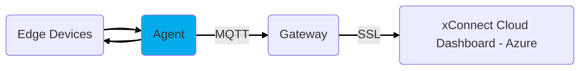

# Agent

This is a required component to any system or edge device that you would like to be monitored by the xConnect
Remote Management Platform. 

This agent is responsible for collecting health information (also
called telemetry) as well as securely facilitating remote management features.

## Download
The latest version of the Agent installation executable is available on our download repository: [downloads.senecaxconnect.com](http://downloads.senecaxconnect.com)

## Installation
1. Download the latest xConnect Agent from the Downloads Repository
2. Extract zip file
3. Right-click on the setup file and select 'Run as Administrator'
4. Proceed through installer, accepting all prompts
5. Open Windows Service Manager and verify "xConnect Agent Core" service exists and is `Running`

!!! note
    Step 3 is important! The background services may fail to install if the installer is not ran with elevated privileges!
    
## Windows Service
The Agent consists of a single background Windows Service, the `xConnect Agent Core`.

The Agent Core service is responsible for the following functions and modules:

### Telemetry Engine
This function is the telemetry collection engine that continuously polls various sensors
throughout the system. It is also responsible for transmitting this telemetry to the Secure
Gateway. 

**Telemetry Collection and Submission occurs every 2 minutes (every even minute).**

### VMS/CMS Integration Module
This module is the telemetry collection engine that continuously polls 
supported Video Management Systems or Content Management Systems for health and additional meta data of connected IP cameras (VMS).
It is also responsible for transmitting this telemetry to the Secure
Gateway.

**Telemetry Collection and Submission occurs every 2 minutes (every odd minute).**

### Auto-Updater Module
This module handles touchless over the wire updates of the Agent.
An update package can be delivered to the Secure Gateway, and the Agent will
automatically download and install this update unattended. 

**Checks for updates every 5 minutes**

### Agent Web Interface
This module provides a local (or LAN accessible) web interface for managing and
configuring the Agent. Starts Automatically as part of the Agent Core and
is accessible from the local machine @ http://localhost:8885 or on a networked machine
@ http://IP_OF_SERVER:8885

!!! note
    This web interface is required to enable Cloud support and configuration of the gateway
    connection! 

### Remote Command Module
This module handles remote commands that are securely received through the
gateway. It is responsible for executing and tracking status of remotely triggered
commands. Commands or scripts that are currently supported are Windows CMD and
Windows PowerShell. 

### Agent RESTful API
This module provides a mechanism for 3rd party applications to ingest or transmit
telemetry in and out of the Agent. 
