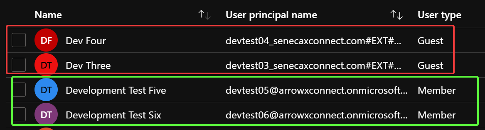
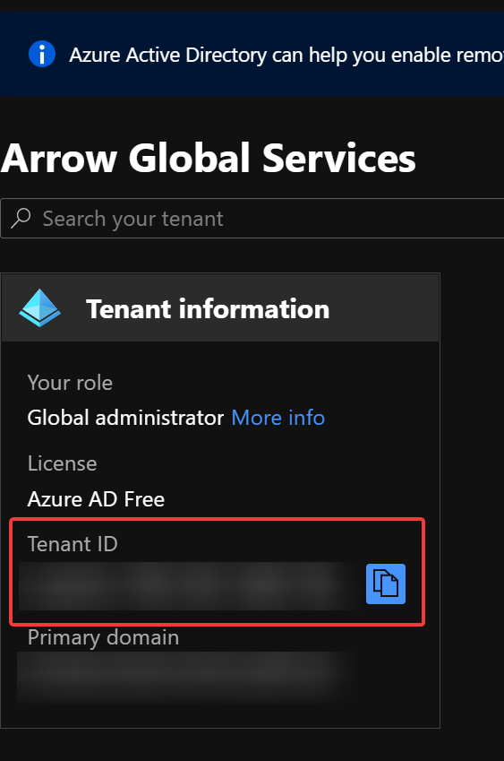
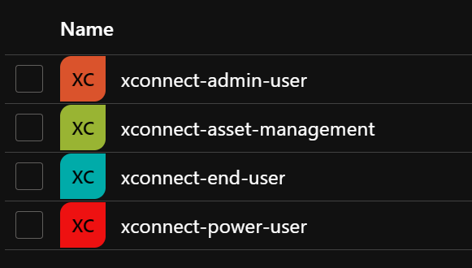

# Azure-Based Active Directory Authentication
xConnect supports Azure-based Active Directory integration that will enable you to leverage your AD instance for managing permissions within xConnect.
The integration is very beneficial for larger xConnect implementations that have many users accessing the tool. The AD integration requires the following in order to be activated with your xConnect tenant:

 - Azure AD Tenant ID
 - Custom subdomain for accessing xConnect and our Asset Management portal (i.e. tenant.senecaxconnect.com, tenant-assetmgmt.senecaxconnect.com)
 - Creation of xconnect-specific AD groups that users can be assigned.
 - Approval and consent of our xConnect in your Azure Portal
 
## How to setup Azure AD integration
 
### Current limitations
 Prior to requesting Azure AD integration, please note that as of April, 2021 xConnect currently supports the following: 
 - Only full members of the Active Directory subscription are supported. Guests are not currently supported at this time: 
 

In the example above, the dev four and dev three accounts are not supported for xConnect integration, while test five and six are. 

 - xConnect end user accounts with customer-specific dashboard visibility are not supported. Only end user types with "Overview" dashboard access can be integrated with AD.
 
### Setup process
 1\. Send an e-mail to support@senecaxconnect.com with the subject "Azure AD Request". Include the following information: 
 - Company name that has been used for your xConnect subscription
 - Preferred subdomain for accessing xConnect. Must not have any special characters. Example: (abccompany.senecaxconnect.com)
 - Do you require access to the asset management portal (https://www.assetmgmt.senecaxconnect.com)
 - Your Azure AD Tenant ID
    - This can be found by logging in to your Azure Portal and going to "Azure Active Directory":
    
    
 
 2\. Create the following groups in your Azure Active Directory instance: 
 - xconnect-power-user
 - xconnect-admin-user
 - xconnect-end-user
 - xconnect-asset-management
 
 
 
 3\. Assign your users to the appropriate groups. Please note that a user can only belong to 1 of the power, end, or admin user groups and the asset management account. Example: 
 
 User A assigned xconnect-power-user, xconnect-asset-management <-- Correct
 
 User B assigned xconnect-end-user, xconnect-admin-user <-- Incorrect
 
 4\. Log in to your Azure portal and go to Azure Active Directory. Register for the "xConnect" Application via App Registrations.
 - Ensure that an admin provides consent to access your AD group information, otherwise users will not be able to log in to xConnect
 
 5\. Once you have received notification from our support team that your subdomains have been created and are ready for use, you may begin using your AD integration. 
 
 