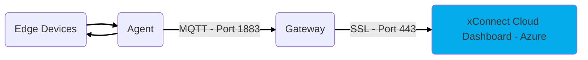

# Web Dashboard

The Web Client Dashboard is hosted by Arrow via Microsoft Azure and is included in the cost of
xConnect Remote Management Platform license annual fees. No need to manage your own
cloud costs, we take care of that for you!

## Gaining Access
The Web Client Dashboard can be accessed at the following URL: https://senecaxconnect.com

You will need to be onboarded by the xConnect Administration team to access the Web Client Dashboard. 
This process is initiated by your Seneca account manager 

Once onboarded, you will be emailed login instructions.

When launching the URL, you will be prompted to enter your username and password. This is
the account provided by the xConnect Administration team or your account owner.

## Server/Device Organizational Hierarchy
The organizational structure of your customers and their respective servers and devices are
very important to understand. 

This organization is integral to simplifying configuration of Events
and Alerts and the correct visualization of objects in your dashboard screens.

There are 3 levels to the organizational hierarchy: Customer, Gateway, Server/Device

### Level 1 – Customer
These are managed and configured via the
Manage Customers screen.

### Level 2 – Gateway
These are managed and configured via the
Manage Gateways screen and are assigned to a
Customer

### Level 3 – Server/Device
These are all servers that contain a
Server Agent or Devices (connected via integration or added as IP Device) 
that are successfully submitting telemetry to the platform.

## Configuration

Additional dashboard and configuration documentation is available within the Usage Guide section of this
documentation library.