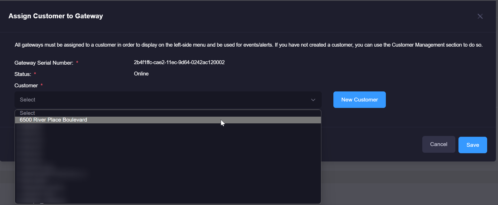

# Dashboard Setup
Once you have set up your gateway and installed the necessary agents, you can access the web dashboard by going to https://senecaxconnect.com

## Initial Configuration
1\. Log in to xConnect by going to https://www.senecaxconnect.com using a modern web browser such as Chrome, Firefox, or Edge. You should have received your login information via e-mail.

2\. At login, you will see a left-side navigation that will enable you to navigate through the various pages within xConnect. There are 3 tabs included on the left-side navigation:
 

- Tab #1: Home - This tab will list all customers, gateways, servers and subsequent monitored devices that are available in your account.
- Tab #2: Bookmarks - This tab will list any resources that you have bookmarked.
- Tab #3: Settings - You can access all **management** features by using this tab. Please note: only POWER USERS will have access to this tab. End users will not see this tab.

3\. Click on the Settings tab () this will show the management menu. 

4\. Click on "Manage Customers", this will allow you to add,remove or update any customers that you would like to see within your portal.

5\. Click the "New Customer" button, which will allow you to add a new customer to the system. Enter the customer information and click the "Save" button: 

6\. Once you have added one or more customers, click on "Manage Gateways", this will take you to the Manage Gateways page that can be leveraged to assign a gateway to a customer. 
The "Awaiting Approval" table shows a list of gateways that have yet to be assigned to a customer. You can assign a gateway by clicking the "Assign" button next to your desired gateway: 

7\. Once you click the "Assign" button, a modal will appear and you can choose your desired customer. 

8\. Once you have approved gateways, you will see the entry added under the assigned customer within the left-side
menu. Verify that the appropriate monitored devices are listed under the gateway

    
