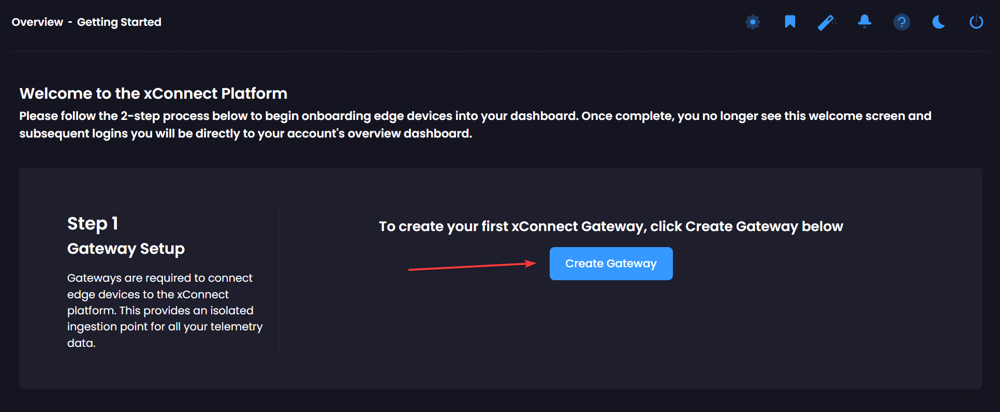
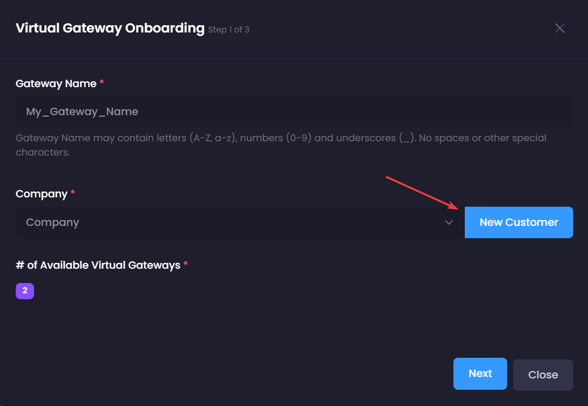
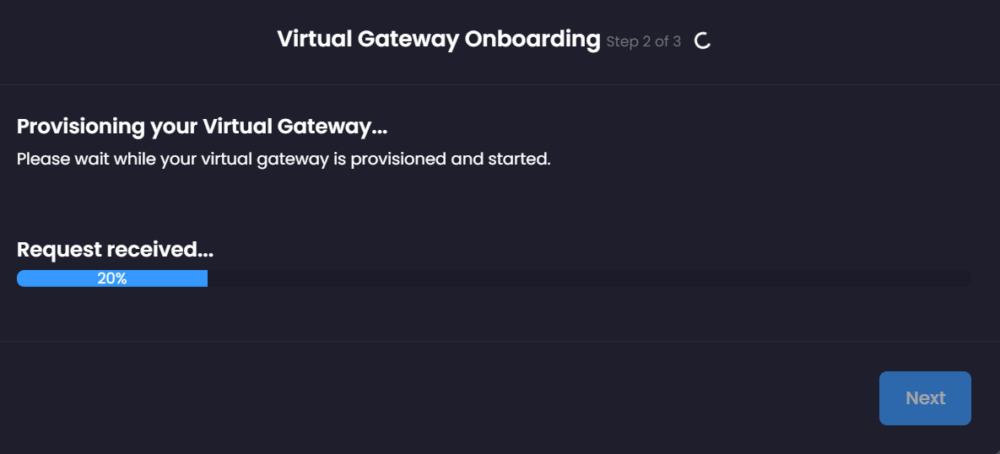
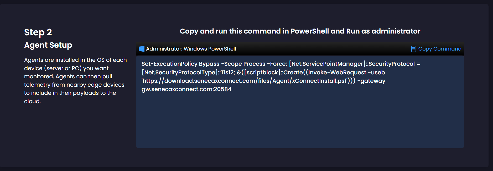

# Getting Started

Setting up xConnect is a breeze. There are only a few steps you need to perform to have your devices firing telemetry to our platform. 

As mentioned in the [Introduction to xConnect](/xconnect_docs/Platform_Overview), a gateway is currently required for all use-cases regardless of internet connectivity in order to connect agents and edge devices to the xConnect platform. 
This gateway is an isolated ingestion and relay point for secure communications between our cloud and your edge devices being monitored and managed.

At a high-level, the steps you need to follow are:

!!! note
    If you have not received your login credentials for [senecaxconnect.com](http://senecaxconnect.com), please contact support@senecaxconnect.com before continuing.

## Gateway and Agent Setup

1. [Confirm Network Requirements](/xconnect_docs/Network_Requirements)
2. Login to ([xConnect](http://senecaxconnect.com)). You will be greeted by a "Getting Started" page
3. Click 'Create Gateway' to create your first Gateway:
   
4. Name your gateway and create a New Customer to associate it to:
   
5. Wait for your gateway creation to complete and click 'Next' and then 'Finish'
   
6. Copy and run the provided command in an Administrative PowerShell terminal on each agent system you would like to connect to the new gateway
   
   

## Dashboard Setup

Once the gateway and agent(s) are installed and configured, you are ready to configure your dashboard. For details on setting up for dashboard, please follow the guides in the navigation menu under 'Guides'
