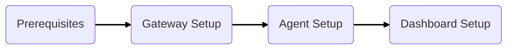

# Quick Start Guide

This guide is a condensed version of the installation process. Detailed instructions are available 
for each step of the installation process and can be found within this guide or on the navigation menu.

Please follow the steps below in the same order of operations as described:

1. Confirm Prerequisites
2. Configure Gateway
3. Configure Agent(s)
4. Configure Dashboard

## Prerequisites

    

Confirm the following before continuing your xConnect installation and configuration:

* Network Access has been configured or confirmed against [xConnect Network Requirements](/xconnect_docs/Network_Requirements)
* You've received credentials for the xConnect Web Dashboard ([senecaxconnect.com](http://senecaxconnect.com))
* Have a PC that can be used to complete IP address changes to gateway (only required if using Seneca-provided Physical Gateway)
    

## Gateway Setup

### xConnect Guardian Virtual Gateway (Arrow-Hosted)

[Virtual Gateway Setup](/xconnect_docs/Gateway_Virtual)

### Physical/Turnkey Gateway (Seneca-provided)

[Turnkey Gateway Setup](/xconnect_docs/Gateway_TurnKey)

###Virtual Machine Gateway (Self-Hosted)

[Docker Gateway Setup](/xconnect_docs/Gateway_Docker)

## Agent Setup

It is recommended to always download the latest version of the Agent. This is available from our 
download repository here:

[Download repository](https://download.senecaxconnect.com/files/Agent/xConnect_Server_Agent(Latest).zip)

## Dashboard Setup

Once the gateway and agent(s) are installed and configured, you can login to your xConnect
Dashboard instance here:

[Seneca xConnect Cloud Dashboard](https://www.senecaxconnect.com)
