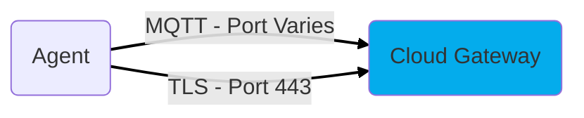
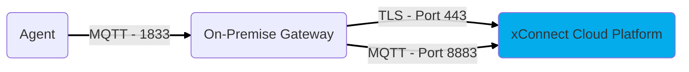

# Network Requirements
The xConnect Agent and Secure Gateway requires very minimal network configuration or firewall rules to
be fully functional. 

Some common industry standard ports that may be required to be open as below based on your use case.

!!! note
    **All rules mentioned below are OUTBOUND only. No Inbound firewall rules required.**

## Topology #1 - Internet Connected Agents

This togology applies to:
- Agents that have outbound access to *.senecaxconnect.com via protocols mentioned below
- Agents connected to an Arrow Hosted Cloud Gateway (AKA vBridge or vGateway)

| **Destination Port**    | **Protocol** | **Description**|**Devices using this rule**                |
|-------------------------|--------------|----------------|-------------------------------------------|
| 443| TLS | API traffic to api.senecaxconnect.com | Agent|
| Varies *| MQTT over TCP | Telemetry/Remote Command handler to hosted gateway at gw.senecaxconnect.com | Agent|

`* This port is provided during gateway creation onboarding. If unsure which port is assigned to your gateway, contact support@senecaxconnect.com`
## Topology #2 - Isolated Network Agents

This topology applies to:
- Agents have access to on-premise Gateway via port 1883 MQTT
- On-premise gateway (physical or virtual machine) has outbound access to:
  - mqtt.senecaxconnect.com (Telemetry Consumer)
  - assetmgmt-api.senecaxconnect.com (Asset Management API)
  - api.senecaxconnect.com (xConnect API)

| **Destination Port**    | **Protocol** | **Description**|**Devices using this rule**                |
|-------------------------|--------------|----------------|-------------------------------------------|
| 1883 | MQTT over TCP | Required for access to api.senecaxconnect.com | Agent|
| 8883| MQTT (SSL) over TCP | Required for access to mqtt.senecaxconnect.com | Gateway|
| 443 | TLS | Required for access to assetmgmt-api.senecaxconnect.com | Gateway|
| 443 | TLS | Required for access to api.senecaxconnect.com | Gateway|

