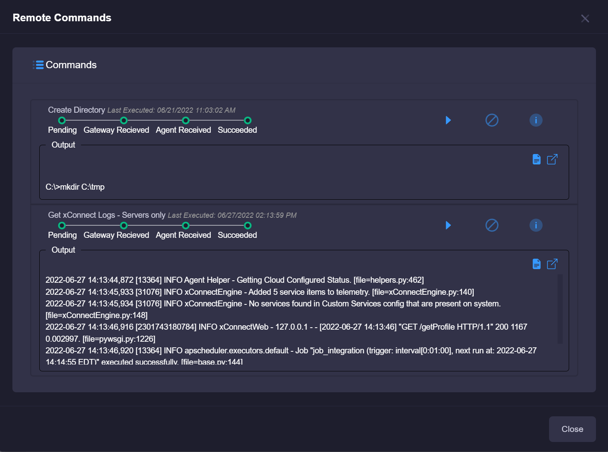
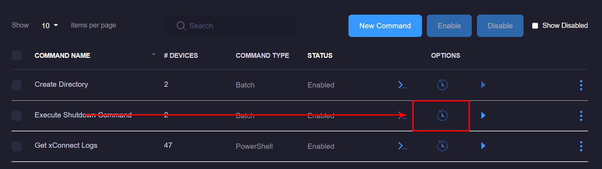
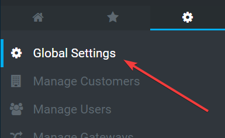
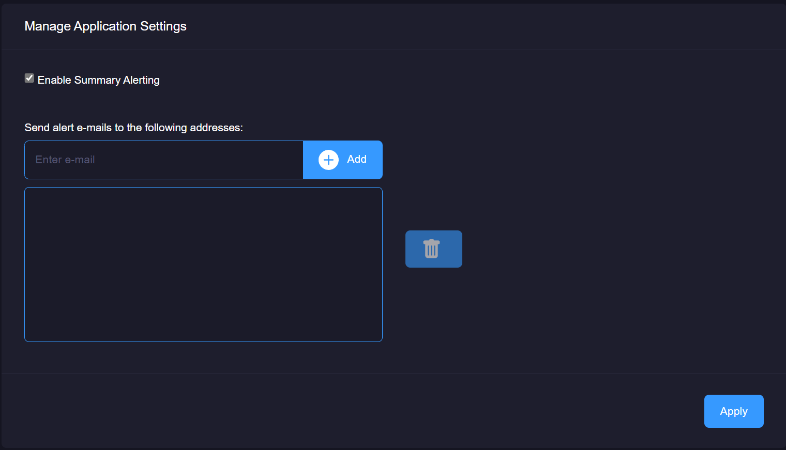
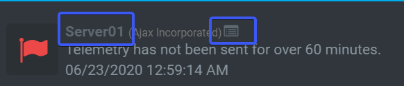
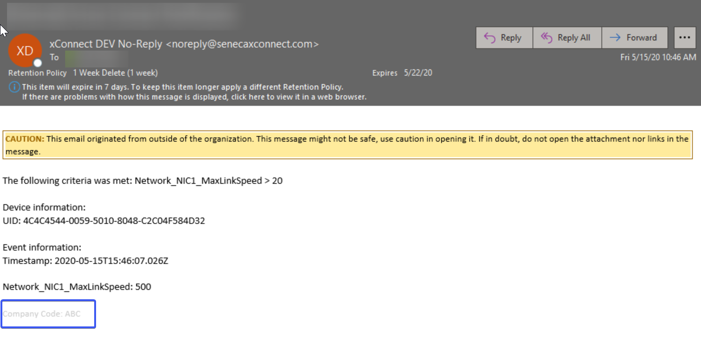
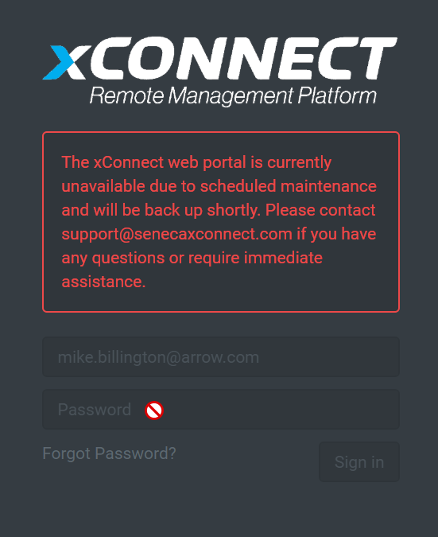

# xConnect Release Notes
[TOC]

# Release 14.0: September 7th, 2020

## Enhancements
- Remote Command Execution Status Support
    - We've added the ability to see the current status of a remote command execution on the device dashboard.
   
   __Note: in order to see an accurate status, you must update your xConnect agent to version 4040 or later.__
   
- Remote Command History
    - There is now a complete list of previous executions for a remote command. You can see this by going to Settings > Remote Commands
    
   
- Backend Process Improvements
    - We've implemented several performance improvements on our backend design to ensure the best user experience possible.
   
## Bug Fixes
- Unlocking a user from Manage Users will now clear out prior bad log in attempts.
- Remote Commands will now fire automatically if assigned to an event.

# Release 13.1: July 16th, 2020

## Enhancements
- Alert Summary E-mail Support
   - We've added the ability to group your e-mail alerts together within a standard summary e-mail template. 
   
   **How to Enable**:
     - Log in using your credentials *note: You must be a power user in order to access this functionality
     - Click on the Settings tab on the left-side menu
     - Click on "Global Settings"
     
     - Upon going to the Global Settings page, check the "Enable Summary Alerting" checkbox and enter one or more e-mail addresses separated by a comma
     
     - Once finished, click the "Apply" button
     
   - Once enabled, you will no longer receive individual e-mail alerts based on your event configurations. A summarized e-mail will be sent that lists the impacted devices and the criteria of the event.

## Bug Fixes
- Newly added devices will now automatically be applied with e-mail alerts, remote commands, or third party connectors based on the enabled Global Event Configurations.

# Release 13: June 23rd, 2020

## Enhancements
- Event Feed alterations to the navigation links.
  - Modified the way the event feed links navigate a user to the appropriate device dashboard and event log listing.
  
  
  
  Upon clicking the device name (i.e. Server01) a user will be taken to the device dashboard. Clicking the table icon () will navigate to the filtered event logs for this particular device.
  
- Company Abbreviation added to all alerting e-mails
  - Enables xConnect support to easily identify which e-mail alerts originated from a particular xConnect customer. 
  
  
  
- Release version # added to the home page, which links to release notes. 

- Maintenance mode: prevents potential spamming of alerts in the occurrence of a scheduled maintenance window. Enhancement prevents users from logging on during the maintenance. 

- User preferences now preserves your selections for expanding or collapsing panels on your dashboards. 

## Bug Fixes
- Event logs now include custom outage duration notices instead of default 60 minute outage windows. 