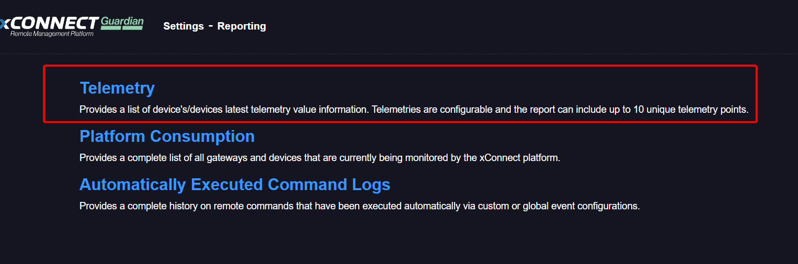
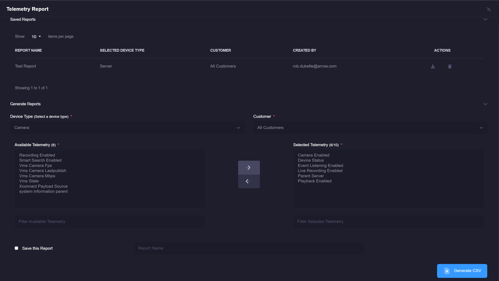
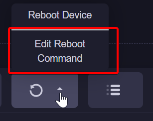
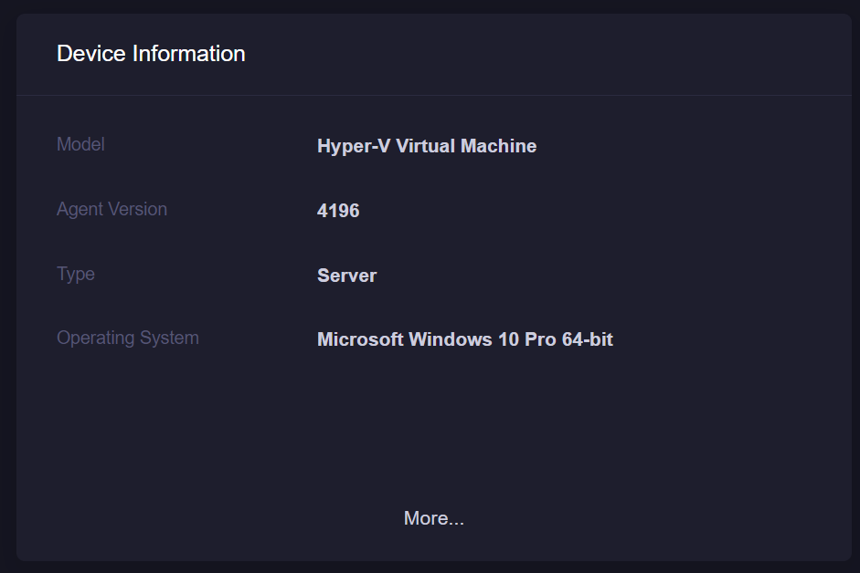
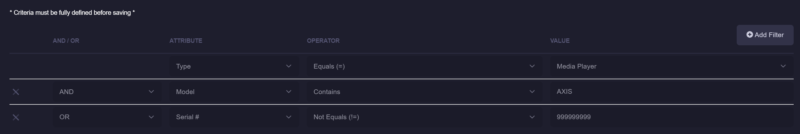
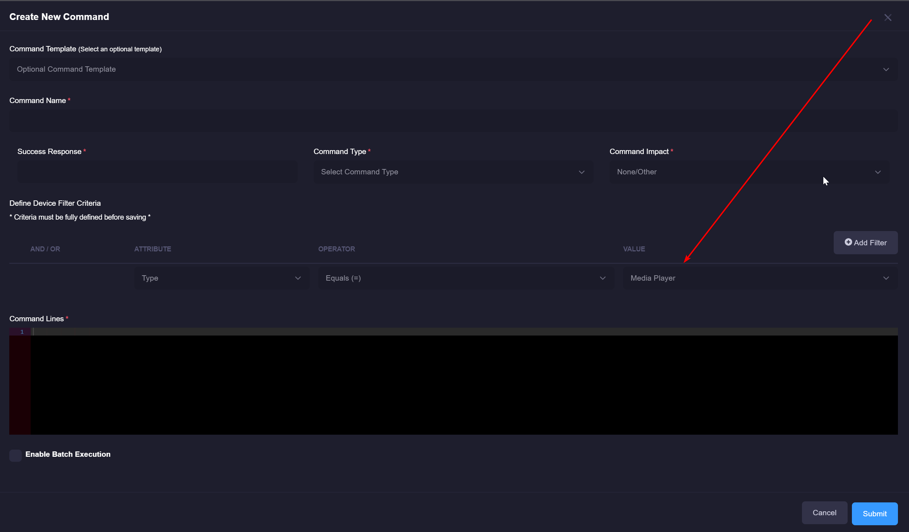
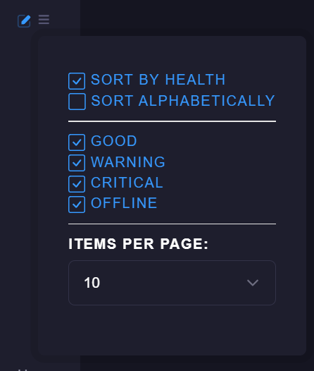
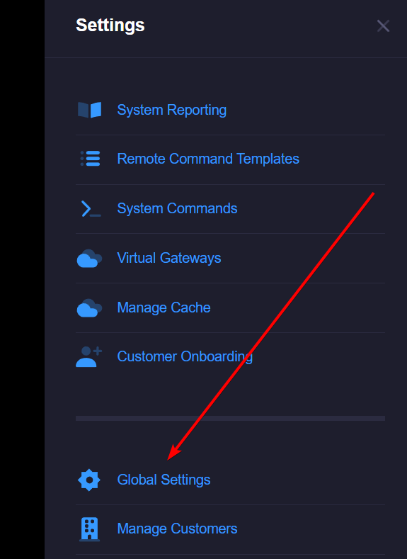

# xConnect Release Notes
[TOC]

# Release 2020.12.0: December 17th, 2020

## Enhancements
- Remote Command improvements:
    - Filtering has been added to the remote command execution history grid, which will allow you to filter by device name: 
    
    
    
    - On the Remote Command history grid, the device names are now links that will take you to the device-specific dashboard:
    
    
    
    - You can now export the entire execution history of a command as a CSV: 
    
    
    
- Reporting is now available for all power users and can be accessed by the settings menu: 

- Latest device telemetry report is now available for use:
    - You can access this by going to the Reporting page. 
    - Click on the "Telemetry" link in the list.
    
    
    
    - This will open a modal enabling you to choose 10 or less telemetry points that will be included in the report.
    The report is a list of all active devices that are filtered by the desired device type. 
    
    
    
    Once your desired settings are selected, click the "CSV" button. This will generate the report as a comma separated file and can be opened in your preferred editor.
    
## Bug Fixes
- Sizing fix for the "Add Customer" modal when assigning a new gateway.
- All remote command buttons on dashboards are now hidden for end user roles. Power users can still access them.
- Copy/paste dashboard URLs are now working correctly.

# Release 16.0: December 1st, 2020

## Enhancements
- New user experience for Server and Media Player Dashboards

- Customizable dashboard reboot button
    - Users may now customize which command is run upon clicking the reboot button on the dashboards.
    
    
    
    ### How to edit your command:
    1. Go to your desired dashboard via the side menu
    2. Click on the reboot button on the information panel.
    3. If the menu is plain text, then the admin has not created a default template for you to use yet.
    If the menu is clickable, you can edit the command by clicking the "Edit Reboot Command" link. 
    
    
    
- Added UUID to the device information panels

 ## Bug Fixes
 - Fix for defining OR criteria on remote command query definitions. 
    - You may now define two or more OR criteria and retrieve your desired devices correctly.
    
  

# Release 15.0: October 15th, 2020

## Enhancements
- Enhanced Device Selection with Query Builder
    - The Remote Command and Custom Event Configuration forms have been modified to support dynamic device queries, which will enable users to easily pull one or many devices based on the following criteria: 
        - Name
        - UID
        - Device Type (Media Player, Camera, Server, etc...)
        - Model
        - Serial #
    
    There is currently no limit on how many filters can be added. NOTE: Any existing custom event configurations or remote commands will have their
    existing device associations preserved, but you must define a criteria if you **edit** the command/event. 
   
   
   Remote Commands: 
    
   You can access the remote command form by going to the Settings tab > Remote Commands. Click Create New Command or the existing name of a command in the grid.
   
   
   
   Custom Event Configurations:
   
   You can access custom event configurations by going to the Settings tab > Event Configurations > Custom Configurations
   
   
   
- Side Menu Paging
    - The side menu now features enhanced pagination controls to ensure fast loading of your dashboards. The # of items displayed is driven by the 
    context menu featured by clicking the  button:
    
    
    
    Choose an item from the "Items Per Page" dropdown and the side menu will only show that # of items per page when viewing devices/servers/media players:
    
    
    
- Global Search
    - We are now supporting global search! You can leverage the side bar search textbox to search across all asset types such as Customers, Gateways, Media Players, Devices, etc... 
    You can perform a search on any dashboard and it will provide you a complete list of matching items.
    
    
    
- Customizable Event Feed
    - You can now customize how many events you want displayed on all event feed panels: 
   
    
    
    Clicking the gear icon will open a modal enabling you to define how many items you would like displayed on each page: 
    
    
    
        
## Bug Fixes
- Name of the device is now driven by the hostname sent via the agent.
- Clicking on the bookmark tab preserves your current location on the site.

# Release 14.0: September 7th, 2020

## Enhancements
- Remote Command Execution Status Support
    - We've added the ability to see the current status of a remote command execution on the device dashboard.
   
   __Note: in order to see an accurate status, you must update your xConnect agent to version 4040 or later.__
   
- Remote Command History
    - There is now a complete list of previous executions for a remote command. You can see this by going to Settings > Remote Commands
    
   
- Backend Process Improvements
    - We've implemented several performance improvements on our backend design to ensure the best user experience possible.
   
## Bug Fixes
- Unlocking a user from Manage Users will now clear out prior bad log in attempts.
- Remote Commands will now fire automatically if assigned to an event.

# Release 13.1: July 16th, 2020

## Enhancements
- Alert Summary E-mail Support
   - We've added the ability to group your e-mail alerts together within a standard summary e-mail template. 
   
   **How to Enable**:
     - Log in using your credentials *note: You must be a power user in order to access this functionality
     - Click on the Settings tab on the left-side menu
     - Click on "Global Settings"
     
     - Upon going to the Global Settings page, check the "Enable Summary Alerting" checkbox and enter one or more e-mail addresses separated by a comma
     
     - Once finished, click the "Apply" button
     
   - Once enabled, you will no longer receive individual e-mail alerts based on your event configurations. A summarized e-mail will be sent that lists the impacted devices and the criteria of the event.

## Bug Fixes
- Newly added devices will now automatically be applied with e-mail alerts, remote commands, or third party connectors based on the enabled Global Event Configurations.

# Release 13: June 23rd, 2020

## Enhancements
- Event Feed alterations to the navigation links.
  - Modified the way the event feed links navigate a user to the appropriate device dashboard and event log listing.
  
  
  
  Upon clicking the device name (i.e. Server01) a user will be taken to the device dashboard. Clicking the table icon () will navigate to the filtered event logs for this particular device.
  
- Company Abbreviation added to all alerting e-mails
  - Enables xConnect support to easily identify which e-mail alerts originated from a particular xConnect customer. 
  
  
  
- Release version # added to the home page, which links to release notes. 

- Maintenance mode: prevents potential spamming of alerts in the occurrence of a scheduled maintenance window. Enhancement prevents users from logging on during the maintenance. 

- User preferences now preserves your selections for expanding or collapsing panels on your dashboards. 

## Bug Fixes
- Event logs now include custom outage duration notices instead of default 60 minute outage windows. 