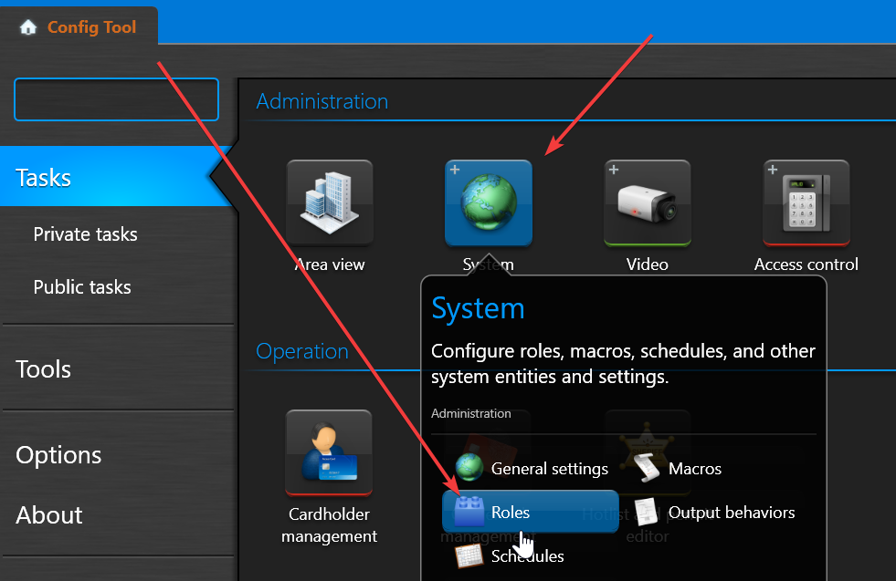
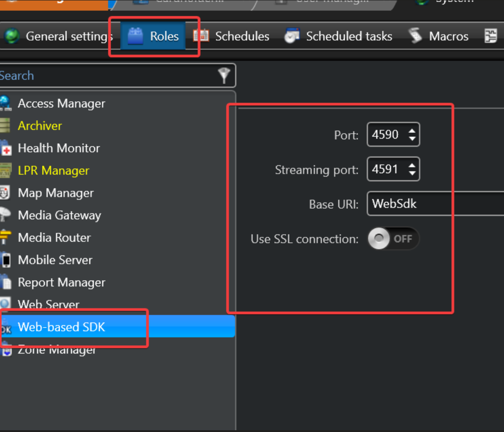
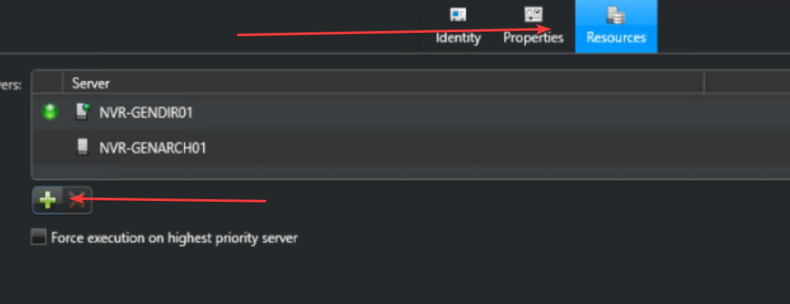
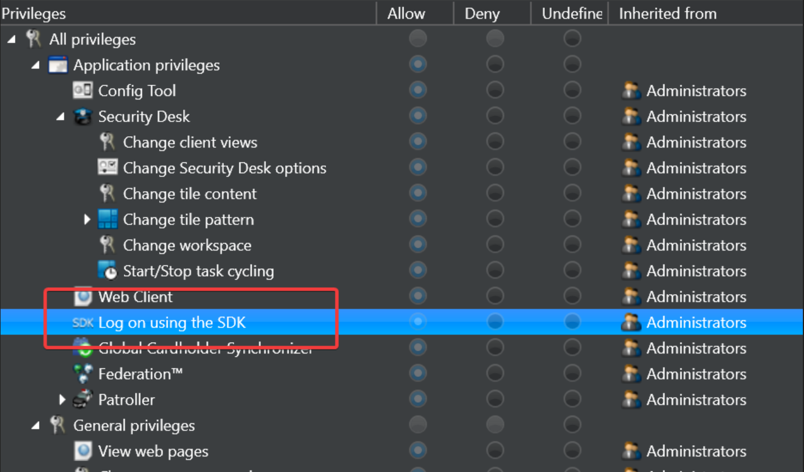
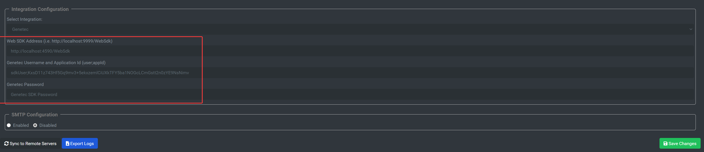

# Genetec - xConnect Integration
## Preliminary Setup
### SDK Role Creation and Authentication
1. Open the Genetec Config Tool on the server where Genetec has been installed. 

2. Go to System > Roles:

3. In order to use the web-based REST API, you must create a "Web-Based SDK" role in Genetec via the Configuration Tool. This will allow you to define the port, streaming port, and the base URI of the integration: 

4. In the Roles management screen, go to the Web SDK role, click on "Resources", this will allow you to define which directory server(s) and archiver(s) will be accessible via the Web SDK.

NOTE: The "Base URI" field will define the prefix for the URL, based on the config above, the API can be accessed by going to http://localhost:4590/WebSdk/<endpoint>

5. Once the role is created, define a user for accessing the SDK. Ensure that the user has the role: 

6. You can now access the SDK by going to the URL, with BASIC AUTHENTICATION enabled. Use the following for user/pass:
Username should be the following format:
username;applicationId

Our xConnect application Id is: **zn3n4f25mfJnxZZtKwpdF27BkdfKlGQsyNlTHtz25Gqxkn71d0JNy1A1PSR281nr**

password would be the same as the user you setup in Genetec.

## xConnect Configuration
### Important Note
As of agent version 4069+ the Genetec integration submits telemetry to the xConnect Cloud platform **only**. You will not see your Genetec cameras pulled in to your LOCAL xConnect agent dashboard.

### Genetec Configuration
1. Install the xConnect agent on the server running the Genetec directory server or archiver.

2. Once the xConnect agent is installed, go to http://localhost:8886/settings

3. Choose "Genetec" as your desired VMS integration, enter the URL for your genetec host (should be http://localhost:4590/WebSdk **if using default Base URI and port #**)

4. Enter the username and password. Username will be the login username followed by a semicolon and the app id. (i.e. sdkUser;zn3n4f25mfJnxZZtKwpdF27BkdfKlGQsyNlTHtz25Gqxkn71d0JNy1A1PSR281nr)

5. Click "Save Changes" - at this point the agent will begin submitting telemetry driven from your Genetec API to your cloud gateway.