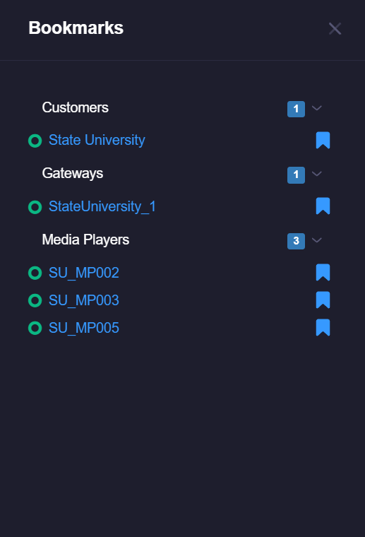

# Bookmarks
Bookmarks are a marker that can be placed on any customer, gateway, server or device that will make it appear on the Bookmarks menu. 
This can be completely customized and managed by the **power user**. Bookmarks are visible across **all** users of the account, **end users** cannot remove or add bookmarks.

## Accessing Bookmarks
You can access bookmarks by clicking the bookmark icon on the left-side menu:

Once there you will see a complete list of your bookmarked assets. Upon clicking the asset, you will be taken to the appropriate dashboard.

## Adding or Removing a Bookmark
You can add or remove a bookmark by going to left-side menu, and clicking the   edit icon

Once edit view is active, you will see the bookmark icons listed to the right of the menu items: 

Clicking the bookmark icon  will enable or disable the bookmark. 

 = Disabled bookmark (will not appear on your bookmark list)

 = Enabled bookmark (will appear on your bookmark list)