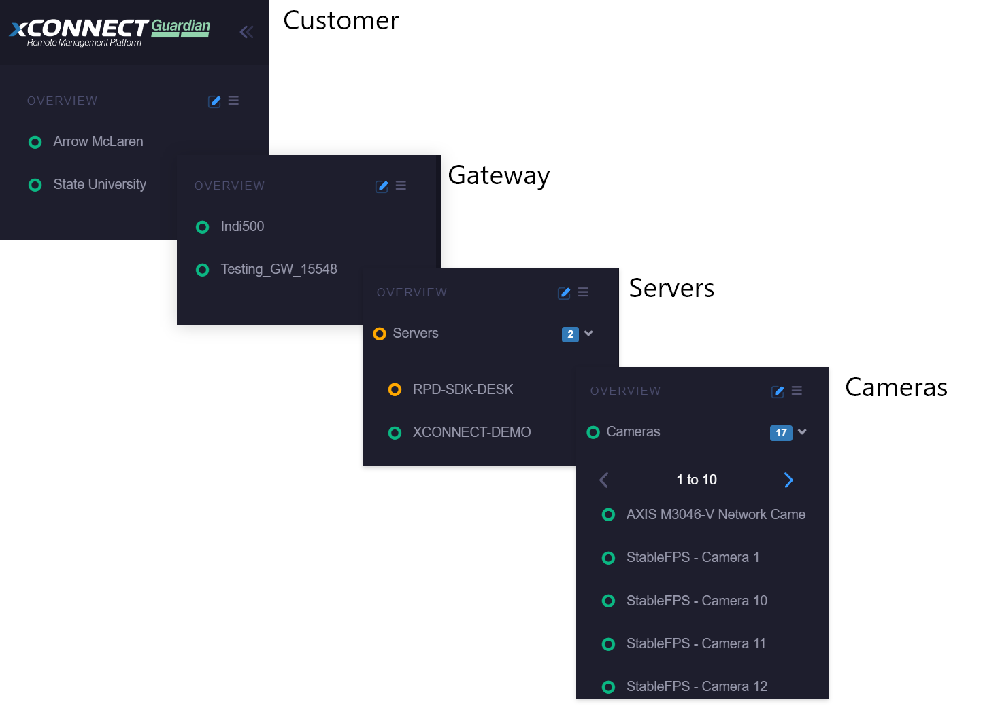

xConnect features intuitive dashboards that enable you to review the current status of your ecosystem across all of your security-related systems. 

The web client dashboard can be accessed by going to https://www.senecaxconnect.com

You will be provided a master login account and be onboarded by the xConnect Administration team to access the Web Client Dashboard.
When launching the URL, you will be prompted to enter your username and password. This is the account provided by the xConnect Administration team or your account owner.
The following are summaries of the functionality you can expect in the Web Client Dashboard:

## Server / Device Organizational Hierarchy
Upon logging into the web portal, you will see the primary navigation on the left-hand side that lists all of your available customers, gateways, servers, and devices. This organization is integral to simplifying configuration of Events and Alerts and the correct visualization of objects in your dashboard screens.
There are 4 levels to the organizational hierarchy: Customer, Gateway, Servers, and Devices. Clicking into each level will show the child associations and the dashboard: 

- Customers: These are managed and configured via the Manage Customers page.
- Gateways: Managed via the Manage Gateways page and are assigned to a specific customer.
- Servers: These are servers that have the xConnect agent running. These are automatically detected when the gateway is connected.
- IP Devices / Cameras: Cameras that are being detected by the agent via the server. These will show up underneath each server -or- in a separate category on the server menu. 

## Dynamic Dashboards 
One of the primary pieces of functionality that the client web portal features is the dynamic
dashboards that leverage the telemetry information being transmitted from your servers and
devices. These dashboards include 3 different levels:

1) Overview Dashboard: 
2) Gateway Dashboard:
3) Server Dashboard:
4) Device Dashboard: 