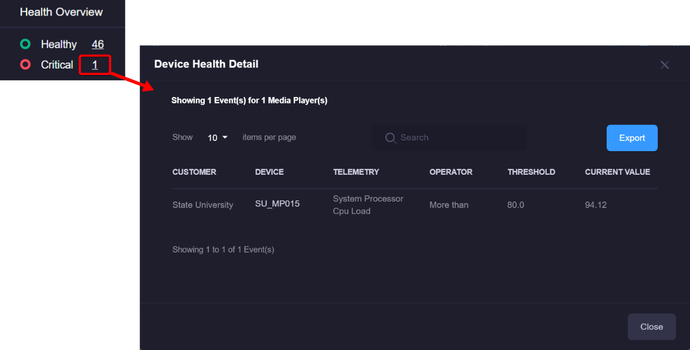
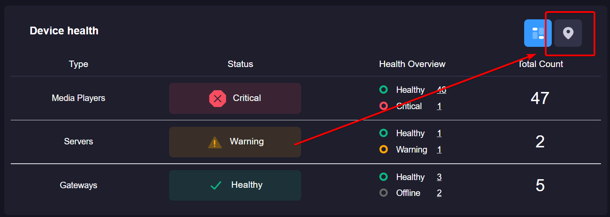
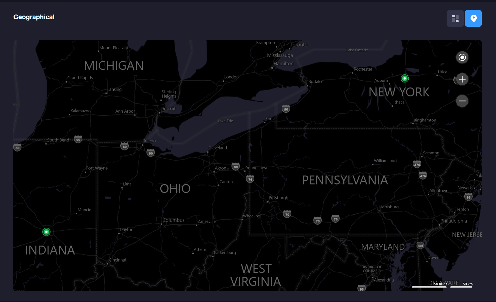
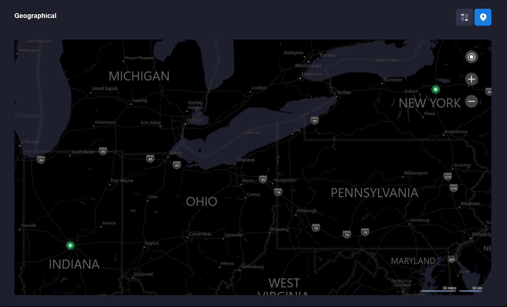
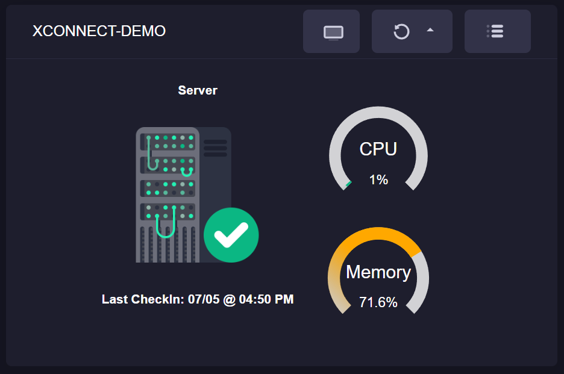
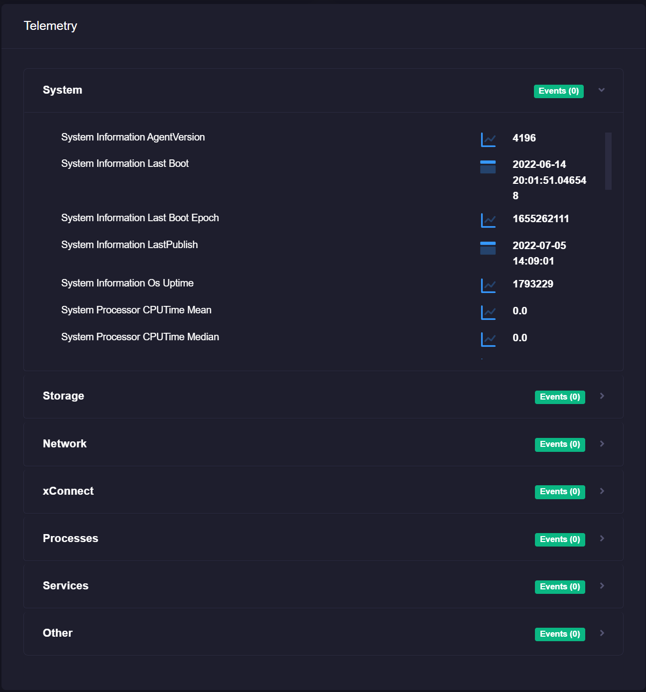
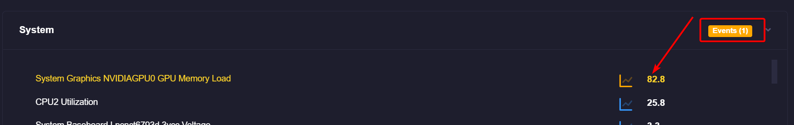

#Dashboards 
xConnect features intuitive dashboards that enable you to review the current status of your ecosystem across all of your networked edge devices. 

The web client dashboard can be accessed by going to https://www.senecaxconnect.com

You will be provided a master login account and be onboarded by the xConnect Administration team to access the Web Client Dashboard.
When launching the URL, you will be prompted to enter your username and password. This is the account provided by the xConnect Administration team or your account owner.
The following are summaries of the functionality you can expect in the Web Client Dashboard:

## Server / Device Organizational Hierarchy
Upon logging into the web portal, you will see the primary navigation on the left-hand side that lists all of your available customers, gateways, servers, and devices. This organization is integral to simplifying configuration of Events and Alerts and the correct visualization of objects in your dashboard screens.
There are 4 levels to the organizational hierarchy: Customer, Gateway, Servers, and Devices. Clicking into each level will show the child associations and the dashboard: 

- 1\. **Customers:** These are managed and configured via the Manage Customers page.
- 2\. **Gateways:** Managed via the Manage Gateways page and are assigned to a specific customer.
- 3\. **Servers:** These are servers that have the xConnect agent running. These are automatically detected when the gateway is connected.
- 4\. **IP Devices / Cameras:** Cameras that are being detected by the agent via the server. These will show up underneath each server -or- in a separate category on the server menu. 

## Dynamic Dashboards 
One of the primary pieces of functionality that the client web portal features is the dynamic
dashboards that leverage the telemetry information being transmitted from your servers and
devices. These dashboards include 4 different levels:

1) **Overview Dashboard:** Provides a complete view of all gateways, servers and monitored devices. Ensures that you know exactly what's happening throughout your monitored infrastructure. Includes the following panels:

   - Device Health: Provides a breakdown of all device types and their health. Each type will be represented by a colored panel, which indicates its health and a count of how many assets are identified as a particular type:
   
   
   
   For guidance on how health is defined, please see topic [Defining Health](#defining-health)

   Upon clicking the displayed number of devices, a detail modal will appear giving you a complete list of all devices/gateways in that particular health status: 

   

   The table includes a list of any events that have occurred on the particular device(s). There may be more than 1 line item per device if there are multiple events occurring.

  - Device Health (Geo View Mode):  Map that shows the location of multiple customers. For more information on defining a customer's location, please see [Navigation/Side Menu](#)

   

   Upon clicking the geoview icon, the panel will display a map with the locations of each customer: 

   

  - Event Feed: Provides a list of events that have been thrown over the last 36 hours.
  
  

   
2) **Customer Dashboard:** Provides a view of all monitored devices that are being reported from a specific gateway.
    
  - Customer Overview: Provides a breakdown of all device types and their health for a **specific customer**. Each type will be represented by a circular chart. 

   
   For guidance on how health is defined, please see topic [Defining Health](#defining-health)
  
  - Event Feed: Provides a list of events that have been thrown over the last 36 hours.
  
  
  
  - Geo-View: Map that shows the location of a customer's gateways. For more information on defining a gateway's location, please see [Navigation/Side Menu](#)
  
  

3) **Gateway Dashboard:** Provides a view filtered for a specific gateway's monitored devices. The dashboard widgets are the same as the Customer Dashboard, except filtered to the specific gateway.
   The Geo-View map is driven by the location of the particular servers. 
   
4) **Server/Device Dashboard:** The Server/Device specific dashboard provides a detailed view of a server/device's telemetry and events. 
   - Actions / Management Panel: Provides CPU, and RAM Utilization information, along with management operations such as remote desktop and remote command execution. 
   
   

   - Device Information: Provides detailed information about the device/server. 
   
   
   
   - Telemetry Information: This panel provides a categorized view of telemetry being submitted to the platform by the device. Each category can be expanded and features a detailed view of the latest values reported by the xConnect agent.
   
   

   The panel will include the number of events that have occurred on a particular piece of telemetry, and highlight the specific item that is currently in violation of a threshold: 

   

  - Event Feed: Provides a list of events that have been thrown over the last 36 hours.
  
  

# Defining Health
Health is determined by a combination of predefined and custom event configurations. The severity of the event has a direct impact on how the health is determined. 
Users have control over _most_ of the built-in/predefined events that are part of the xConnect platform. Custom events are completely user-driven and can be modified at any time.

**How is health determined?**

- If a monitored device has thrown an event that has a severity of ERROR, or CRITICAL, it is considered to be in **BAD** health.

- If a monitored device has thrown an event that has a severity of WARNING, then it is considered to be in a **WARNING** state.

- If a monitored device has not submitted telemetry to the platform for over 60 minutes, then it is considered to be in an **OFFLINE** state.

- Lastly, if the monitored device has thrown an INFORMATIONAL event, or there were no events thrown within the last 36 hours, then that is considered to be in **GOOD** health

## Predefined Events
There are several events that are built into the platform that are meant to cover common occurrences of what may happen to a monitored ecosystem. These include: 
1. **Gateway Heartbeat:** The gateway heartbeat is driven from the xConnect gateway software and is meant to provide a signal of whether or not the gateway can successfully communicate with the core platform. 
At a minimum, the gateway must be able to communicate with the platform within 5 minutes. If this is exceeded, the event is considered to be critical to the gateway.
 
2. **Telemetry Received:** xConnect expects that all monitored devices will send telemetry within 60 minutes. If there is no telemetry sent for a device beyond 60 minutes, an offline event will be thrown. 

3. **Recoveries:** All events that are thrown (custom or predefined) will receive a RECOVERY event when they go back to normal operating standards.

## Custom Events
Custom events are those that can be modified by a power user via the Event Configuration management page. For more information on the management page, please see [Managing Event Configurations](https://senecaxconnect.github.io/xconnect_docs/Usage_ManageEventConfigurations/) topic. There are several types of editable event configurations:

1\. **Global Events:** These are applied to a device type and telemetry point. _Some_ global events are predetermined based on our preset thresholds that we have configured over the development of the xConnect platform.

Example: Servers that have a System Thermal CPU 1 Temperature greater than 20C should be in a WARNING state.

2\. **Custom Events:** These can be applied to a specific gateway, server, or device. 

Example: Throw an error severity event if GATEWAYABC:Server-XYZ has RAM Utilization beyond 80%.

3\. **Outage Events** An outage event is when there is no received telemetry for a device over a specified amount of time. These alerts/events apply to an entire category of monitored assets (i.e. Servers, IP Devices, Cameras, etc...) This is meant to act as an alerting mechanism from the xConnect platform. 

### Additional Notes:
By default, xConnect will consider any telemetry outage beyond 60 minutes as an offline event, which will cause your 
device to be flagged as "offline" health. The Outage Event configurations are meant as the alerting mechanism of these occurrences. 
The alerting mechanism is separate from the built-in telemetry received events.

Example: An e-mail should be sent when any server has not sent telemetry for 60 minutes. 