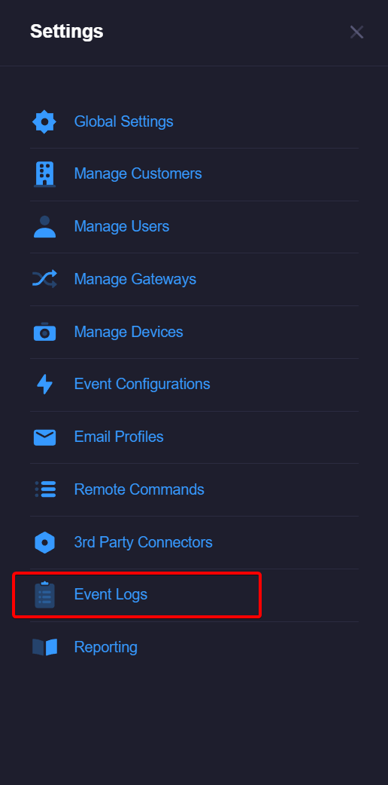
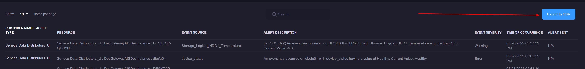
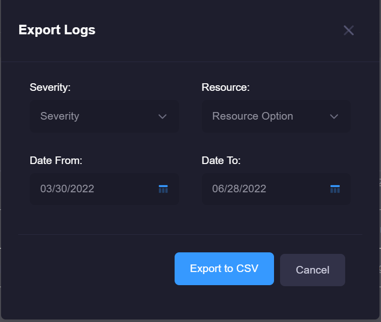

# Event Logs
All events that have been fired on a monitored device can be viewed via the Event Log page. Users can also export the generated logs to a CSV. 

## Accessing Event Logs 
1\. Log in as a power user

2\. Click on the settings tab on the left-side menu 

3\. Click on the "Event Logs" menu item

## Exporting Event Logs
1\. Click on the export button, this will open the filter modal. 

2\. Select your desired severity, resource (optional), and date range. Click "Export to CSV" and the CSV will be generated.

