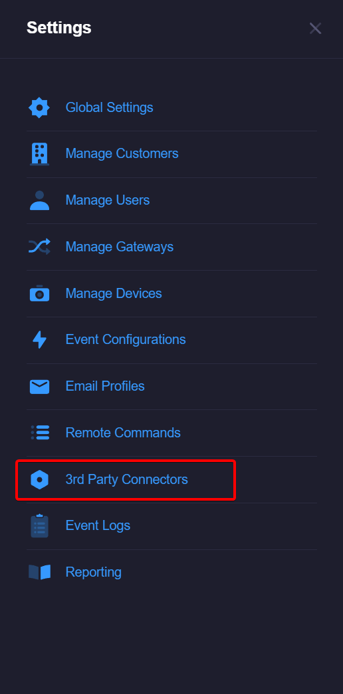
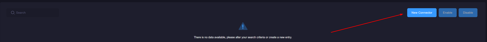
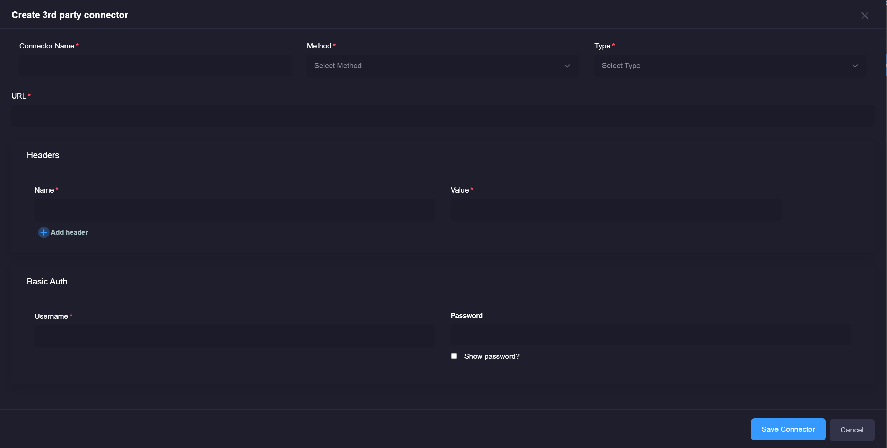

# 3rd Party Connectors
xConnect supports calls to 3rd party external RESTful APIs. Click [here](https://restfulapi.net/) for more information on REST services.

## Accessing 3rd Party Connectors
1\. Log in as a power user

2\. Click on the settings tab on the left-side menu 

3\. Click on the "3rd Party Connectors" menu item

## Adding / Updating a 3rd Party Connector
1\. Click on the "New Connector" button -or- click on the connector name to update an existing connector. 

2\. The editor modal will open and enable you to add or modify a connector. 

Through this editor you can specify your headers, and your body data that will be sent via HTTP POST. 3rd party connectors currently support a JSON, FORM or XML formatted object.

## Activating or Disabling a connector
1\. Use the checkbox controls on the left-side of the grid to select one or more connectors in the table.

2\. Click on Activate or Disable, this will allow you to disable or activate a connector.