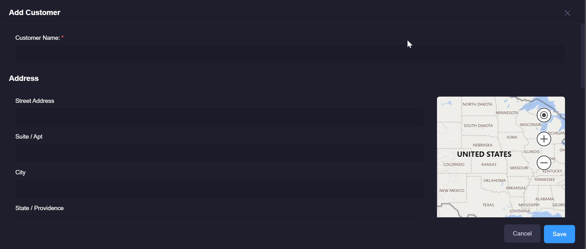
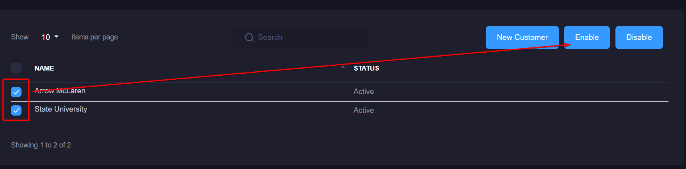

# Manage Customers
Customers are a way to differentiate your various implementations of xConnect gateways in a meaningful way. The platform supports a Managed Service Provider (MSP) model, which means that a single xConnect instance can have one or more customers that are being maintained. 

Any customers added will appear in the left-side menu: 

**Note:**
Only power users and limited power users will be able to access the functionality listed below.
If you are an end user, you will not be able to see the settings menu. 

## Adding or Updating a Customer
1\. Log in as a power or limited power user

2\. Click on the settings icon on the header menu

3\. Click on the "Manage Customers" item on the right-side settings menu.

4\. If you are adding a new customer, click on the "New Customer" button. If you are updating an existing customer, click on the customer's name. 

5\. The customer entry modal will appear where you can either modify or add a new customer to the platform.

## Disabling and Reactivating a Customer
Disabling a customer will remove them from appearing in the side menu, and will remove the associated gateways from the monitoring dashboards.
Prior to disabling a customer, you **must** disable any associated gateways. Failure to do so will produce an error message indicating that you cannot disable the customer(s) with the associated gateways. 
You can disable a customer by performing the following steps:

1\. Log in as a power user

2\. Click on the settings icon on the header menu

3\. Once on the Manage Customers page, you can select one or more customers via the checkbox on the left. 
When 1 or more customers are checked, you can click either the "Activate" or "Disable" button.

