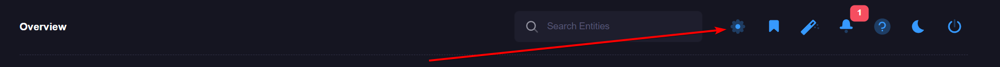
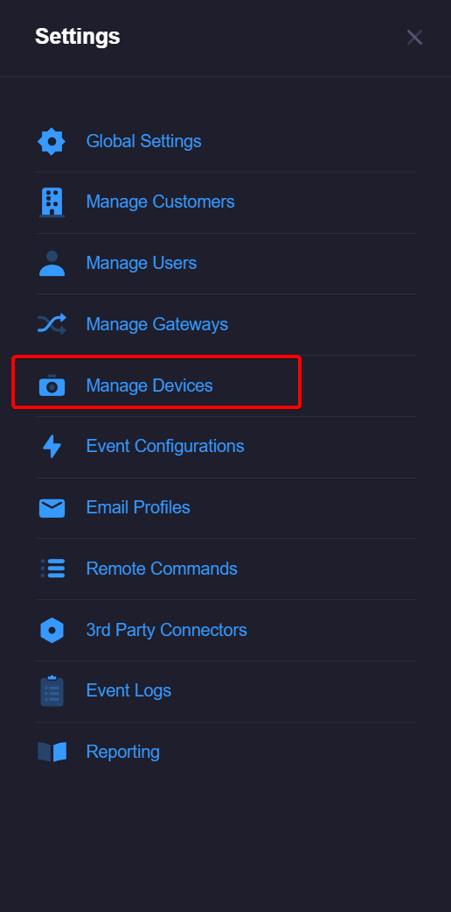
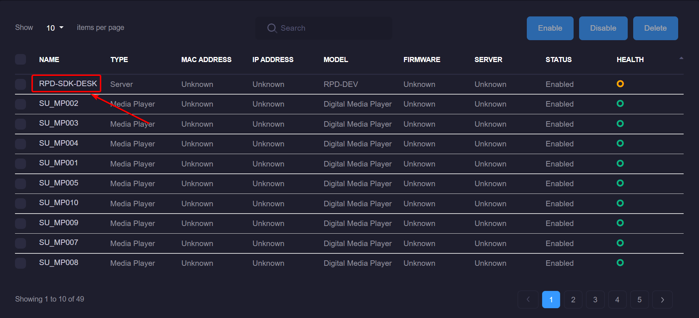
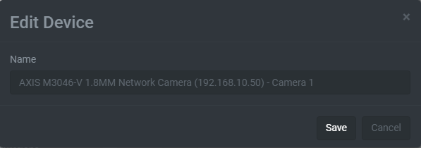
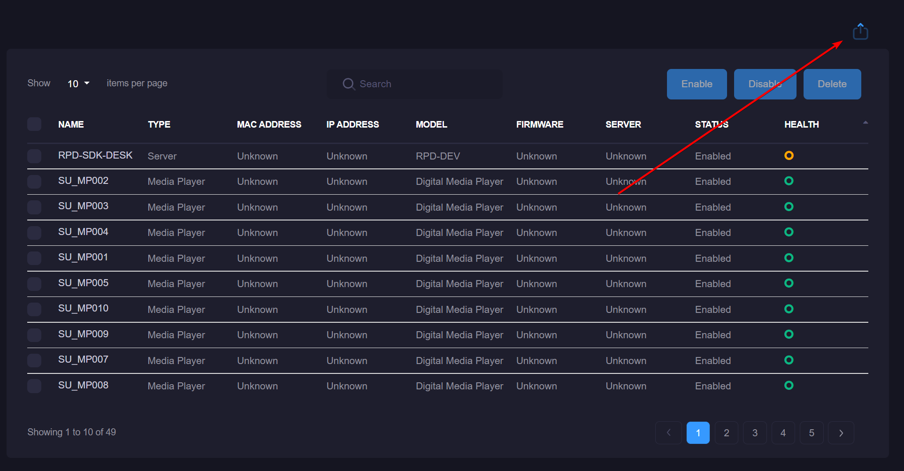

# Manage Devices
The device management page allows you to modify, disable, or remove any IP Device, Camera or generic device that's being monitored by xConnect. Note: you cannot remove a server or gateway from this interface. 

## Accessing Device Management
1\. Log in as a power user

2\. Click on the settings tab on the left-side menu 

3\. Click on the "Manage Devices" menu item

## Updating a Device Name
In order to update a device name, click on the name of the device via the grid on the Manage Devices page:

Once you have clicked the name, a modal will appear enabling you to enter a different name for the device. This will impact what's displayed in the navigation menu and event logs.

### Exporting list of devices
You can export your complete list of devices to CSV by clicking the export button 

### Removing, Enabling or Disabling Devices
You can remove, disable or re-enable a disabled device by using the checkboxes on the left side of the grid and the action buttons on the table header. 

**Removing** a device will cause the device and associated telemetry to be removed from the system. 

**Disabling** a device will remove the device from the left-side menu and you will no longer receive alerts for that device.

**Enabling** a device will make it appear on the side menu again. NOTE: You will have to set up any custom events/alerts again if this was disabled prior.

 