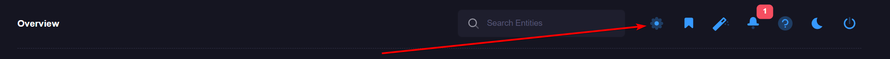

# Manage E-mail Profiles
E-mail profiles are similar to mailing lists for a particular event, which supports one or more recipients and a custom e-mail template. 

## Accessing E-mail Profiles
1\. Log in as a power user

2\. Click on the settings tab on the left-side menu 

3\. Click on the "Email Profiles" menu item

## Defining a new profile
1\. Click on "New Email Profile"

2\. Define an e-mail profile name, and a list of e-mail recipients. Multiple recipients can be separated by a comma (,)

3\. Choose an e-mail template using the dropdown. If you require a new template, please see [Defining a template](#defining-an-e-mail-template)

# Manage E-mail Templates
E-mail templates define the content for the e-mails that are sent to the defined profile.

## Accessing E-mail Templates
E-mail templates can be accessed by clicking the "New Email Profile" button, and clicking the "Settings" link:

## Defining an E-mail Template
You can define one or more e-mail templates that can be leveraged for your alerts. Custom templates provide your users a meaningful e-mail alert that can empower them to take action on a certain alert. 

1\. Click on the "New Email Template" button (or to edit, click on the name of the template) 

2\. The editor modal will appear and you may define your e-mail template. HTML is supported and you can define dynamic values by leveraging [Smart Tags](#Smart_Tags)

3\. Once you have defined your template, you can associate it to an e-mail profile via the dropdown in the profile editor. 

## Smart Tags
Smart tags can be used in any e-mail template, remote command or 3rd party connector. A smart tag is a dynamic label that is altered based on the device that fired the event. 

| Smart Tag | Description |
|:---------|:-----------|
| {Criteria}       |  Shows the criteria that fired the event.   |
| {DeviceHID} | Device HID |
| {DeviceName} | Name of the device that fired the event. |
| {DeviceUID} | Unique ID for a device. |
| {DeviceType} | Asset type of the device that fired the event. |
| {Timestamp} | Date/time when the event was fired. |
| {FullTelemetry} | Full telemetry payload that caused the event to fire. |
| {TelemetryValue} | Telemetry value that caused the event to fire. |
| {TelemetryName} | Raw telemetry key that caused the event to fire. |
| {TelemetryDescription} | Telemetry friendly name that fired the event. |
| {ThresholdValue} | Value that the event was comparing against. Defined in the event configuration |