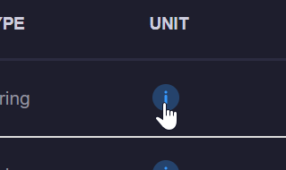
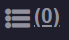
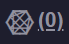

# Event Configurations
Event configurations allow xConnect users to be notified of any abnormality within your monitored devices. 

There are 3 different types of event configurations: 

1\. **Global Events:** These are applied to a device type and telemetry point. _Some_ global events are predetermined based on our preset thresholds that we have configured over the development of the xConnect platform.

Example: Servers that have a System Thermal CPU 1 Temperature greater than 20C should be in a WARNING state.

2\. **Custom Events:** These can be applied to a specific gateway, server, or device. 

Example: Throw an error severity event if GATEWAYABC:Server-XYZ has RAM Utilization beyond 80%.

3\. **Outage Events** An outage event is when there is no received telemetry for a device over a specified amount of time. These alerts/events apply to an entire category of monitored assets (i.e. Servers, IP Devices, Cameras, etc...) This is meant to act as an alerting mechanism from the xConnect platform. 

## Accessing Event Configurations
1\. Log in as a power user

2\. Click on the settings tab on the left-side menu 

3\. Click on the "Event Configurations" menu item

## Global Event Configurations
Global event configurations apply to a **device type** and are automatically defined based on a set of default thresholds that are part of the xConnect platform.
All telemetries are considered to be candidates for a global event, but some require additional input. 
Any global event must have the following information to be used for alerting: 

  - Operator
  - Threshold Value
  - Severity
  
Without these fields defined, the "Requires Input" flag will be enabled and the event cannot be applied to alerts. 

### Editing Global Events
The global event configuration table allows for in-line editing of existing data. You can edit the Friendly Name, Unit, Operator, Threshold or Severity by simply double-clicking the cell: 

   

Upon clicking the green check box, the value will be saved and applied.

## Custom Event Configurations
Custom event configurations are those that can be applied to a specific gateway, server or device. These events are completely defined by the Power User. 

### Defining a Custom Event
1\. Click on the Custom Configurations tab

2\. Click on the "Create Custom Event" button

3\. The editor modal will appear and you may define your custom event. 

   - Select your customer, gateway, and server via the dropdowns
   - Select the specific telemetry you would like to monitor
   - Choose your threshold operator, define a value or range of values
   - Finally, choose the severity
   
Click the "Create Event Definition" button, and the event will be added to the system.

4\. Once finished with adding the new event, you can apply alerts as needed. See [Applying an alert](#applying-an-alert). 

## Outage Configurations
Outage configurations apply to scenarios where an asset/device type has not received telemetry in a defined period of time. 
Example: Alert via e-mail when any server has not sent telemetry in 30 minutes. 

### Defining an outage configuration
1\. Click on the Outage Configurations tab

2\. Double click on either the No Telemetry or Expiration cells. The No Telemetry (Minutes) column defines how many minutes you would
like to wait until a no telemetry event is detected. The Expiration field is how long it will take before another notification/action is executed. 
Example: Detect when there is no telemetry for 60 minutes and alert me every 24 hours. 

Once the outage is fully defined, you can [apply an alert](#applying-an-alert).

## Applying an alert
An E-mail, Remote Command, or 3rd Party Connector can be applied to any event configuration by leveraging the action column in the grids.
**Note:** Only events that are fully defined and do not require input can be used for alerting. 

The number next to each icon indicates how many actions for each category are active for this event.

**Actions Defined:** 

 Dashboard Notifications: determines if the event will appear on the dashboard notifications list.

 E-mail Alerts: upon this event firing, an e-mail will be generated based on your associated e-mail profile. See [Email Profiles](/xconnect_docs/Usage_ManageEmailProfiles) for more information. 

 Remote Commands: a command will automatically be executed upon the occurrence of the event. See [Remote Commands](/xconnect_docs/Usage_ManageRemoteCommands) for more information.

 Third Party Commands: call to an external REST-based API will be made upon the occurrence of the event. See [Third Party Commands](/xconnect_docs/Usage_ManageConnectors)

**Activating an Alert**

Click the e-mail, connector, or command icon. This will open a modal that features a list of available alerts to apply: 

 

Select 1 or more alerts and click the "Activate Alerts" button. If you would like to disable alerts, click the "Disable Alerts" button.

Once this has been done, the alerts will be applied to your event and the alerts will fire upon the occurrence of the event. 

