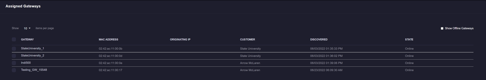

# Manage Gateways
Gateways are the primary mechanism for sending information to the xConnect platform. For initial setup and approval process, see [Dashboard Setup](/xconnect_docs/Dashboard_Setup)

## Accessing Gateway Properties
In order to see additional information about an assigned gateway, click on the name of the gateway **after** you have assigned it to a customer.

The modal with gateway information will appear and will allow you to define a description for the gateway and view any associated devices. 

The "Edit Gateway" modal features the list of devices that are being transmitted by the gateway, the MAC address, serial # and assigned customer information. 
Power Users can define a description to help track gateways.