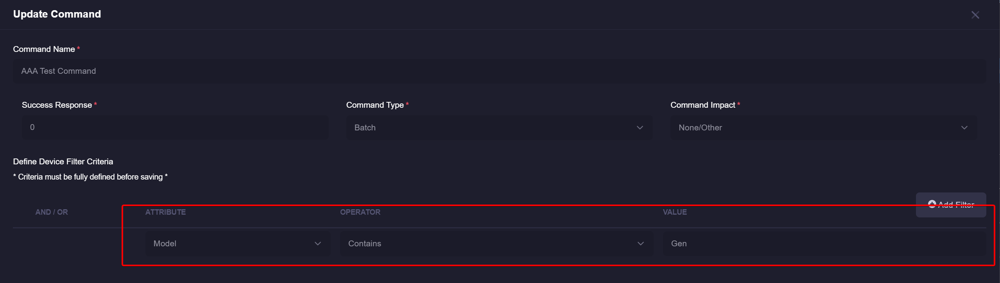
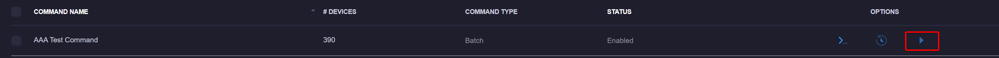
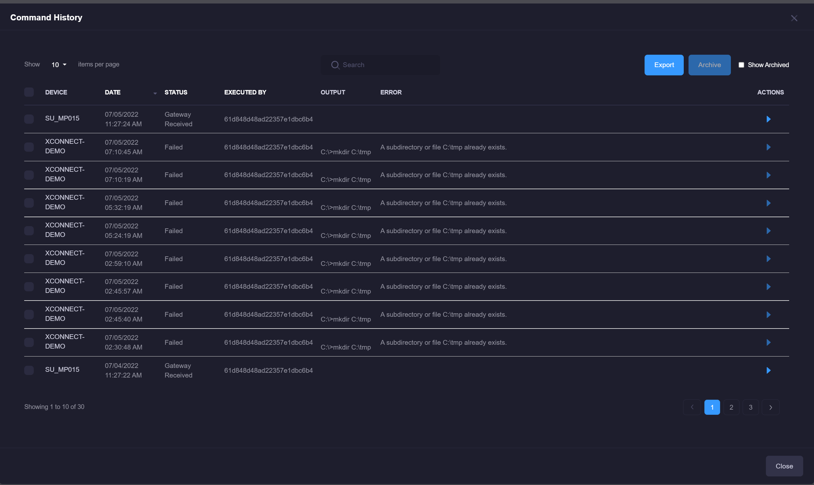
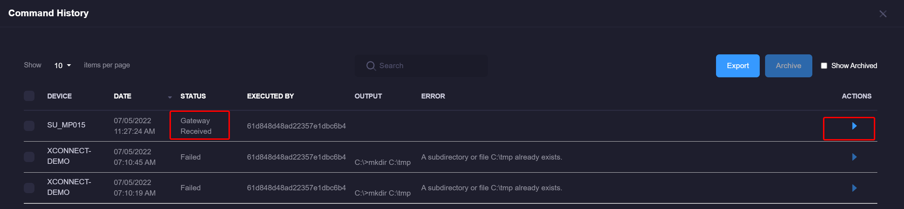

# Remote Commands
Remote commands can be executed remotely on a monitored server. 
These can be leveraged with a particular event and will automatically fire as its reported by the xConnect agent.
For more information about applying remote commands to an event, please refer to [Event Configurations](/xconnect_docs/Usage_ManageEventConfigurations)

## Accessing Remote Commands
1\. Log in as a power user

2\. Click the settings icon on the header menu

3\. Click on the "Remote Commands" menu item

## Creating a new command
1\. Click on the "Create New Command" button

2\. The editor modal will appear, you can then define the new command. 

 
 Select one or more Devices that apply to this command. The selection of these devices will drive what commands are available on the device dashboard, and which devices will receive the command if "batch" execute is clicked.

3\. Once you have specified your command name, response code, and command lines, click the "Submit" button. 

## Updating an existing command
1\. Click on the name of the command in the grid, this will open the editor modal. 

2\. Make your desired changes, click the "Submit" button. 

## Activating or Disabling a command
1\. Use the checkbox controls on the left-side of the grid to select one or more commands in the table.

2\. Click on Activate or Disable, this will allow you to disable or activate a command.

## Batch Command Runs
You can either run a remote command manually via the Device-Specific dashboard, or batch command on the remote command management page. 
Batch commands can only be run by Power Users and must be flagged as a batch-enabled command in order to do so. A "batch" command is executed on all impacted devices defined as part of the remote command: 

 

In the example above, the command will be applied to any device that has a "model" attribute that contains the characters "Gen"
Upon clicking the execute button, all applicable devices will be sent the command: 

 

## Accessing Command History
1\. Click on the "History" icon  on any remote command that is listed in the grid.

2\. A modal will appear with any applicable previous runs of the command. There will be no rows listed if the command has never been run previously. 

By leveraging the command history modal, you can re-run previously failed attempts or archive the particular history items. 
Archiving history will hide it from the exported CSV file and it will no longer appear in the modal.

### Re-running a pending command
1.\ Open the history of a particular remote command

2.\ Find the specific run that is pending and needs to be re-run. NOTE: Only commands that are in a "pending" state such as "Gateway Received" or "Pending" will have the ability to be re-run. 

3.\ Click on the play button. The modal will automatically refresh with the latest status of the command run. 

