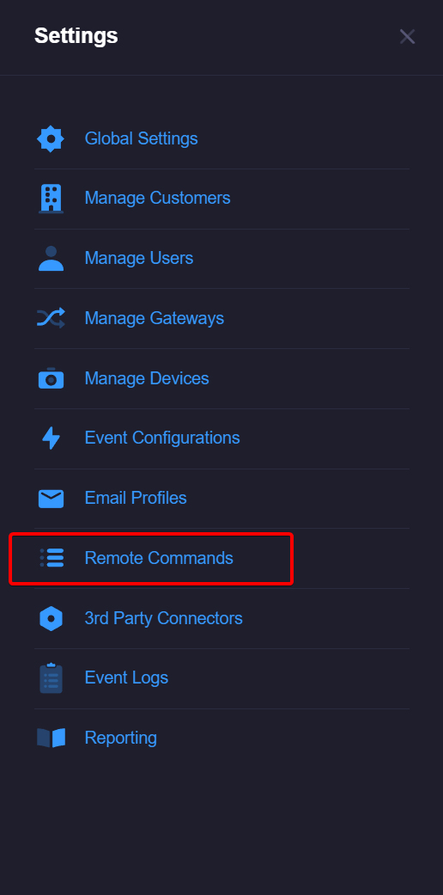
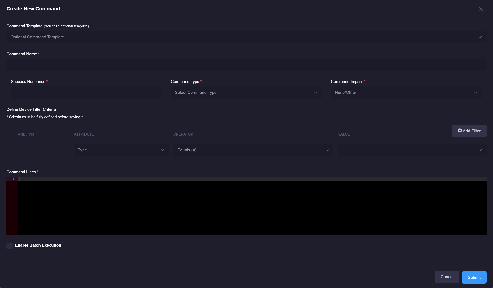
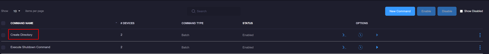

# Remote Commands
Remote commands can be executed remotely on a monitored server. 
These can be leveraged with a particular event and will automatically fire as its reported by the xConnect agent.
For more information about applying remote commands to an event, please refer to [Event Configurations](/xconnect_docs/Usage_ManageEventConfigurations)

## Accessing Remote Commands
1\. Log in as a power user

2\. Click on the settings tab on the left-side menu 

3\. Click on the "Remote Commands" menu item

## Creating a new command
1\. Click on the "Create New Command" button

2\. The editor modal will appear, you can then define the new command. 

 
 Select one or more Devices that apply to this command. The selection of these devices will drive what commands are available on the device dashboard.

3\. Once you have specified your command name, response code and command lines, click the "Submit" button. 

## Updating an existing command
1\. Click on the name of the command in the grid, this will open the editor modal. 

2\. Make your desired changes, click the "Submit" button. 

## Activating or Disabling a command
1\. Use the checkbox controls on the left-side of the grid to select one or more commands in the table.

2\. Click on Activate or Disable, this will allow you to disable or activate a command.