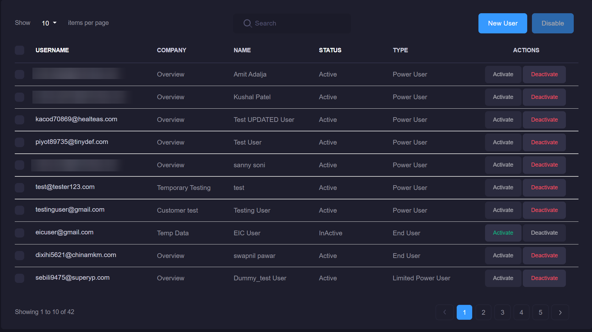
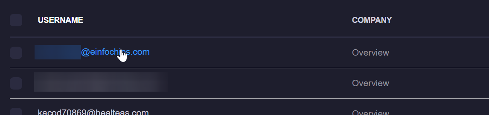
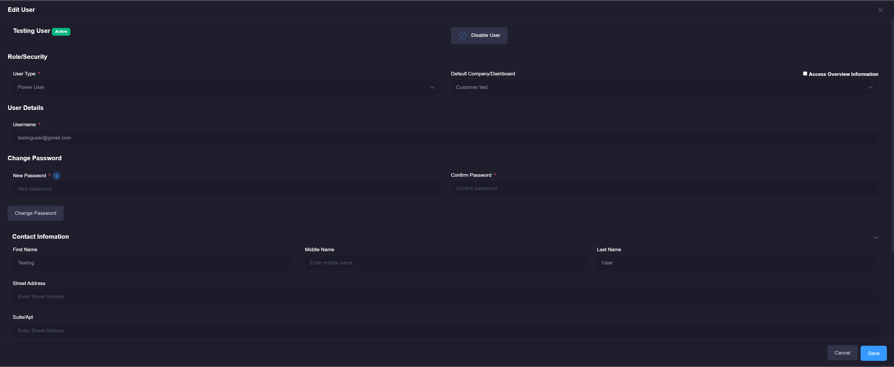

# Manage Users
Power users have the ability to add, remove or modify existing users on their xConnect instance. 
Limited power users have similar rights to power user, but cannot execute batch commands.
End users can be associated with a specific customer which will show that customer's dashboard to the end user upon login.

1\. Log in as a power user

2\. Click on the settings gear on the header menu 

3\. Click on "Manage Users".

Once there you will see the primary management interface:

You can deactivate a user by clicking the "Deactivate" button, or activate them by clicking "Activate" 

For more information on the differences between Power, Limited Power, and End users, please visit [User Types](https://senecaxconnect.github.io/xconnect_docs/Usage_Roles/)

## Add a user
1. Click on the "New User" button (both buttons will take you to the correct page)
2. Once the User entry modal appears, Enter the following information for your user:
      - User's e-mail (used for login)
      - Password
      - User type (either Power user, Limited Power User, or End user)
  
3. Click save. 

The user will be created and sent an activation e-mail. Once they have confirmed their account, they will be able to access the xConnect portal.

## Update an existing user
1\. Click on the user's name via the grid on the main manage users page:

2\. The update modal will appear and allow you to make any changes that you require. 

1. Lock Account: This will lock the user's account so they can no longer login until you unlock it. Note: a user can unlock their account if they reset their password.

2. Disable User: Marks the account as disabled. User will not be able to access their account until they are activated. 

