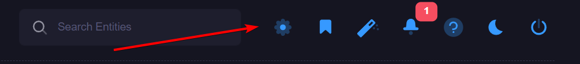

# Side Navigation
The primary navigation for xConnect can be found on the left-side of the portal. 
The side navigation features 3 tabs:

## 1) Home Tab
The home tab  is primary tab that allows you to view all of your customers, gateways, servers and devices. This is used to access the various dashboards featured in the portal.
You can also modify the location, and names of your resources via the edit mode. 

### Editing a resource
 In order to activate the edit view on the side menu, click the icon in the lower-right corner of the menu: 
 
 
 
 Edit mode provides additional icons next to each listed customer/resource: 
 
 Allows you to edit the name of a resource
  
 Allows you to mark a resource for bookmark - the resource will be listed on the bookmarks tab. 
 
 Allows you to define a location for the resource, which will add a pin on the dashboard's Geo-View panel.

#### Specifying a location
In edit mode, click the location icon , which will open the location modal. 

Once the modal appears, enter in the address and click search. This will find your desired address and enable you to set the location.  

Click "Set Location" once the address is found. The resource will now appear on the geo-view. 

### 2) Bookmarks 
The bookmarks list can be accessed by clicking the star tab on the menu: 

For more information on the usage of bookmarks, see [Bookmarks](https://senecaxconnect.github.io/xconnect_docs/Usage_Bookmarks/) topic.

### 3) Settings

The settings tab allows you to manage various aspects of the xConnect platform. For more information, please see the Management section. 
